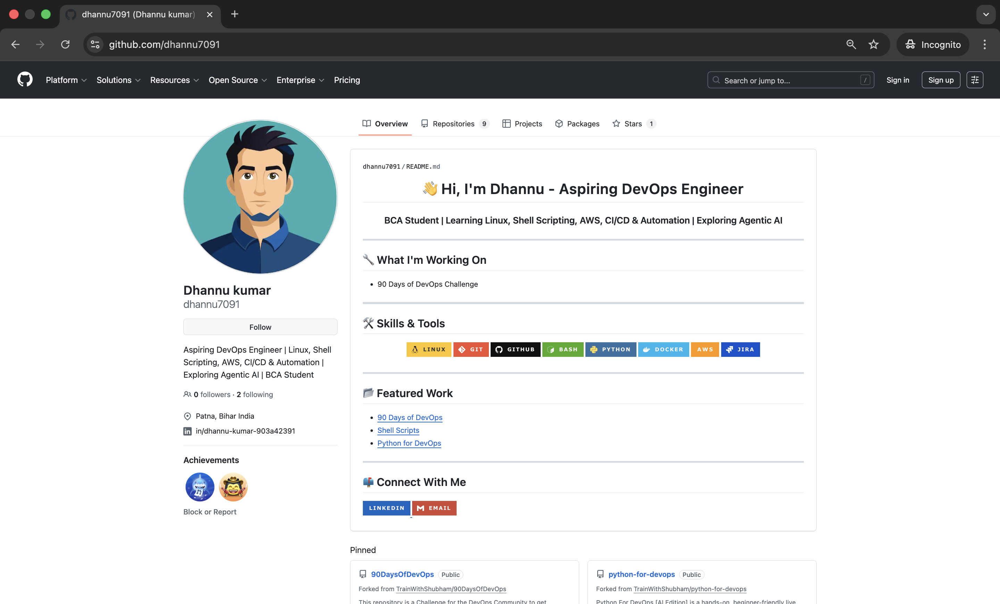

# Day 27 Assignment – GitHub Profile Makeover: Build Your Developer Identity
## Task 1: Audit Your Current GitHub Profile
Before making changes, assess where you stand:

1. Visit your own GitHub profile as if you were a stranger — what impression does it give?
2. Answer in your notes:
- Is your profile picture professional?
  - No
- Is your bio filled in? Does it say what you do?
  - Learning Cloud, Devops engineer
- Are your pinned repos relevant, or are they random forks?
  - 90DaysOfDevOps
- Do your repos have descriptions, or are they blank?
  - Blank
- Would a recruiter understand what you've been working on?
  - No

## After Changes
### 3 Things I Improved and Why
**1. Improved Profile Structure & Visual Consistency**
- I redesigned my profile README to make it clean, centered, and visually balanced.
Previously, content alignment was inconsistent and looked scattered.
- Now the layout clearly presents my role, skills, and goals in a structured way, making it easier for recruiters to understand who I am within seconds.

**2. Organized and Documented Repositories**
- I added proper descriptions, topics, and structured README files to all major repositories (shell-scripts, devops-git-practice, devops-nginx-demo).
Earlier, the repos lacked context and explanation.
- Now each repository clearly explains its purpose, contents, and technical focus, making my work more professional and understandable.

**3. Aligned Profile with My DevOps Direction**
- I removed unnecessary clutter and focused only on relevant DevOps tools and projects.
Instead of listing everything, I highlighted practical skills like Linux, Bash, Git, Docker, and Nginx practice.
- This makes my profile reflect a clear career direction rather than random experimentation.

